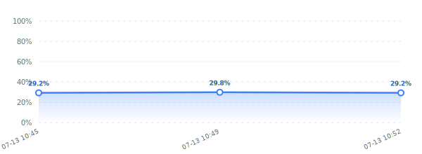

# 🗺️ 陕西省榆林市标注项目进度 (26.7.10.ShanXi)

> [!NOTE]
> 本仓库仅同步 Labelme 标注所生成的 JSON 数据。图片文件保留在本地不进行上传。进度信息和趋势图表在每次本地提交时自动统计更新。

### 📊 标注状态看板

| 统计项 | 数值 | 占比 / 进度条 / 变化量 |
| :--- | :---: | :--- |
| **总图片数 (Total)** | **171** | `[████████████████████]` 100.0% |
| **已标记 (Completed)** | **64** | `[███████░░░░░░░░░░░░░]` 37.4% (较上次 **+0** ⚪) |
| **未标记 (Remaining)** | **107** | `[░░░░░░░░░░░░░░░░░░░░]` 62.6% |

**当前总体进度：**
-blue?style=for-the-badge&logo=github)

### 📈 标注进度趋势折线图

---
*📅 统计更新时间：2026-07-13 11:06:01 (本地)*

---
## 👥 多人协作说明
如果您是本项目的新协作者，拉取代码后只需双击运行目录下的 **`setup_hooks.bat`** 即可在本地激活自动统计 Hook。
激活后，您每次进行 `git commit` 时，该脚本均会自动统计您的进度并更新 `README.md` 一并提交，无需手动操作。
